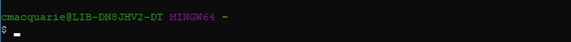
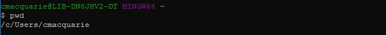
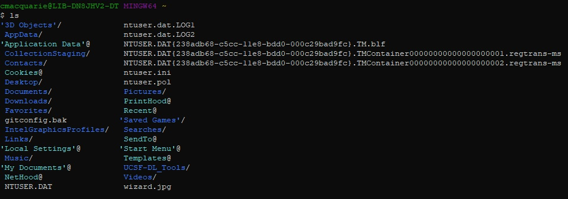
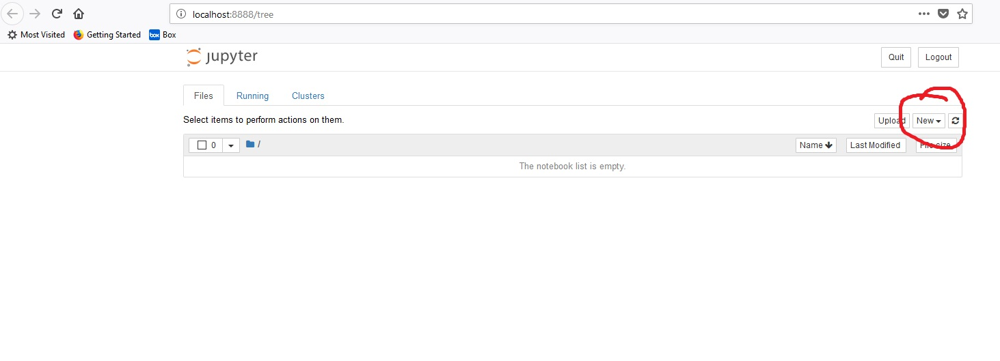

# Intro to Unix Shell
*Extremely brief intro*

This will be an extremely brief intro to the use of the Unix Shell for entering commands on your computer. If you find yourself compelled by the material in this lesson, I'd encourage you to check out the Software Carpentry Lesson all about the Unix Shell, which has much more information than will be covered here. You can find that lesson [here](http://swcarpentry.github.io/shell-novice/).

We will begin by opening up a shell.

If you are on a windows computer, you will likely be using GitBash, which you downloaded in preparation. To find it, press the windows key and begin typing "gitbash." GitBash should come up in the results -- click on it to open the program.

If you are on a mac computer, you can either open your applications folder and navigate to the "Utilities" folder and find Terminal in that folder, or you can press command+spacebar to open Spotlight and then type "terminal" into the search bar.

Either way, when you open it up you will get something that looks like this (though likely with different colors)

This is a way to interact with your computer by typing commands that tell it what to do. (As opposed to using a GUI or Graphical User Interface -- which is what you are using when you are clicking around on your desktop with a mouse). We are only going to go over a few very simple commands which will allow us to start a jupyter notebook to continue the next lesson, but anything you might be able to do with the click of a mouse you can also do by typing into the terminal -- and sometimes with much more power and flexibility.

When we are asking you to type a command we will preface the command with a "$" symbol -- like this:

`$ command -options              `

The "$" indicates that we are asking you to type a command into the terminal, and press the enter key to run the command. You do not type the "$", only the text that follows it. Different systems may use different symbols (on linux it may be a "#"), but generally think of the "$" as just an indicator that we are asking you to type a command.

### Seeing where you are with pwd

You can move around your computer and look in folders at your files just like you can do in explorer or finder or whatever file system viewer is on your machine. First though, we have to know "where" we are right now. To do this, we type the pwd (path to working directory) command, and hit enter to run it:

`$ pwd`

On the line below the line you just typed, It will return where in your computer's file structure you are located. For me, it is this:

You may also notice that it gives you a new blank command prompt line underneath it, ready to receive another command.

### Seeing what's in there with ls

We can also take a look at what files are in the current working directory -- the place we found ourselves in with the pwd command. And just to note, when we say "directory" and "folder" we mean the same thing. To do this, we type the ls (list) command, and hit enter to run it:

`$ ls`

It will return all the files and folders that are in the directory. Hopefully you will start seeing some things you recognize in here, directories like `Documents/` (your documents folder) and `Desktop/` (your desktop folder). Mine looks like this:

### Moving around with cd

We want to be able to navigate into these directories and make changes in them too, so we do that with by typing in the cd (change directory) command, followed by the name of the directory we want to navigate to, and hitting enter. For this example, I will navigate into my `Desktop/` directory, which is where we'll be storing and accessing the stuff for this workshop:

`$ cd Desktop/`

You will probably notice that this time the shell didn't return anything (though depending on your setting in GitBash or native shell the text across the top may have changed). We can verify that we changed locations by typing `$ pwd` again though, and sure enough we can see that now we're in (in my case) `/c/Users/cmacquarie/Desktop`.

### Making a new directory with mkdir

Just as a final topic on the functionality of the shell, if you hadn't already made a folder on your Desktop for the contents of this lesson, you could do that in the shell too using the mkdir (make directory) command. To do this, you type mkdir and then the name of the new directory you want to make (for now, make sure the name has NO SPACES), as so:

`$ mkdir NoMoreSilence`

Again you will notice that the shell does not return anything when you run the command, but if you `$ ls` to see what's on your Desktop you will see that the new folder is there.

*One final thing to note: if you are having trouble with a command, use the help flag to get it to give you some information about how it's supposed to be used. For almost every command, this can be done by adding either '-h' or '--help' after the command itself. So for mkdir this would look like:*

`$ mkdir --help`
*-or-*
`$ mkdir -h`

### Opening a new jupyter notebook from the command line

Now that we've learned some commands in the shell, we'll combine them all to open a jupyter notebook, where we'll be typing our python code. We taught you all this because you *must* use a command to open a jupyter notebook, so we want you to remember how to do it!

We want to be in the folder where we'll be working, which in my case is `/c/Users/cmacquarie/Desktop/NoMoreSilence`. It will probably be similar for you, but whatever it is, navigate into it using the cd command on the terminal. For me, this looks like this (I'm using the absolute path here -- you can type any location into the cd command and it will take you right there!):

`$ cd /c/Users/cmacquarie/Desktop/NoMoreSilence`

This should also be the folder where the NoMoreSilence_ProjectData.tsv file you downloaded is located. If it's not there yet, put it there now.

And finally, to begin a new notebook server and open a notebook type the following command into the prompt and hit enter, making sure that you are located in the working folder for this workshop:

`$ jupyter notebook`

A bunch of text will start to appear after the command prompt, which we won't need to worry about unless your notebook doesn't open in a web-browser automatically. You may notice though, that it contains some instructions about your notebook server, how to use it, and what it's doing.

At this point, a web-browser window should open automatically. If it doesn't, ask a helper for help or raise your hand. When it does open, it should look like this:

On the right-hand side of the page, click the "New" button with a dropdown arrow (circled in red above), and select "Python 3" under the "notebook" section. This will open up a new python notebook in another browser tab, and we will begin the coding section.
